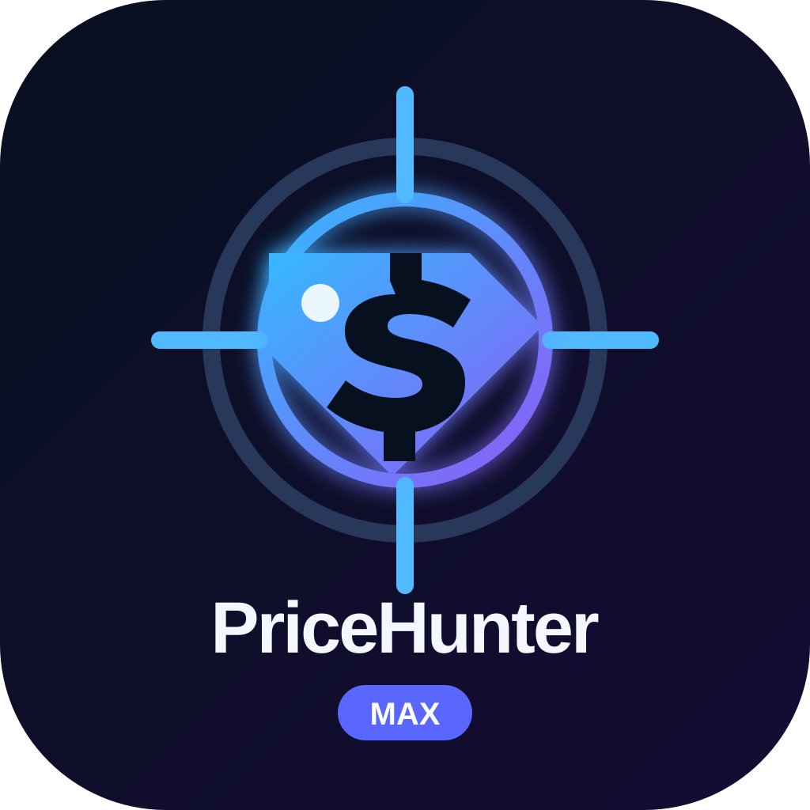

# PriceHunter — бот сравнения цен для MAX

PriceHunter отвечает на вопрос: «Где товар сейчас дешевле с учётом доставки и обязательных сборов?» Это рабочий MVP на Node.js, TypeScript, PostgreSQL и Prisma с интерфейсом чат-бота MAX.



## Что уже работает

- регистрация пользователя и 30-дневный trial;
- поиск обычной фразой;
- нормализация бренда, модели, памяти, RAM, цвета и модификации;
- безопасный matching: 128GB и 256GB не объединяются;
- параллельный поиск через расширяемые `SourceAdapter`;
- расчёт `товар + доставка + обязательные сборы` и сортировка по итогу;
- предупреждение об аномально низкой цене;
- меню MAX, callback- и link-кнопки;
- избранное, история цен с компактным графиком дневных минимумов, город пользователя;
- отслеживание целевой цены и фоновый worker;
- защита от повторных уведомлений и повторной обработки webhook;
- webhook для production и Long Polling для локальной разработки;
- healthcheck, rate limiting, безопасное логирование и обработка ошибок;
- Docker Compose с PostgreSQL 17;
- unit-тесты критической бизнес-логики.

## Источники цен

В версии 0.2.1 есть два адаптера:

- `YmlFeedSource` — реальные открытые или партнёрские YML/XML-ленты магазинов;
- `DemoSource` — только для локальной демонстрации двух тестовых смартфонов.

В production отключите `DemoSource`. Для каждого реального источника сначала получите разрешённую владельцем ленту. PriceHunter не скрейпит витрины, не вызывает скрытые API и не обходит CAPTCHA, авторизацию, `robots.txt` или другие ограничения.

Price.ru предлагает XML-выгрузку в рамках своей партнёрской программы, но доступ к ней выдаётся после заявки: [официальная страница партнёра](https://advertising.price.ru/partnerprice). Публичность веб-страницы сама по себе не считается разрешением на автоматический сбор.

## Актуальный контракт MAX API

Интеграция сверена с официальной документацией MAX на 17 сентября 2026 года:

- Base URL: `https://platform-api2.max.ru`;
- токен передаётся в заголовке `Authorization`, не в query-параметре;
- отправка сообщения: `POST /messages?user_id=...`;
- callback подтверждается через `POST /answers?callback_id=...`;
- production получает события через `POST /subscriptions` и HTTPS webhook;
- webhook доступен снаружи по HTTPS на порту 443 и может проверяться заголовком `X-Max-Bot-Api-Secret`;
- `GET /updates` предназначен только для разработки и тестов;
- лимит отправки — не более двух сообщений в секунду в один диалог.

Официальные страницы: [обзор API](https://dev.max.ru/docs-api), [отправка сообщений](https://dev.max.ru/docs-api/methods/POST/messages), [webhook](https://dev.max.ru/docs-api/methods/POST/subscriptions), [Long Polling](https://dev.max.ru/docs-api/methods/GET/updates).

## Быстрый запуск через Docker

Понадобятся Docker и Docker Compose.

1. Скопируйте `.env.example` в `.env`.
2. Создайте чат-бота в «MAX для бизнеса» и вставьте токен в `MAX_BOT_TOKEN`.
3. Для первого локального теста установите `MAX_MODE=polling`.
4. Задайте надёжный пароль `POSTGRES_PASSWORD`.
5. Запустите:

```bash
docker compose up --build
```

Миграция применится автоматически. Проверка сервиса:

```bash
curl http://localhost:3000/health
```

После запуска откройте бота в MAX, нажмите «Начать» и отправьте название товара. При включённом `DemoSource` можно проверить `iPhone 16 Pro 256GB`.

## Production через webhook

1. Разместите приложение за публичным HTTPS-доменом на порту 443.
2. Используйте сертификат доверенного центра и полную цепочку сертификатов. Самоподписанный сертификат MAX не принимает.
3. В `.env` задайте:

```dotenv
MAX_MODE=webhook
MAX_WEBHOOK_URL=https://your-domain.ru/webhook
MAX_WEBHOOK_SECRET=случайная_строка_минимум_16_символов
AUTO_REGISTER_WEBHOOK=true
```

Допустимые символы секрета MAX: латинские буквы, цифры, `_` и `-`.

4. Перезапустите приложение. При `AUTO_REGISTER_WEBHOOK=true` оно зарегистрирует webhook после открытия HTTP-порта. После успешного запуска верните переменную в `false`, чтобы повторные рестарты не создавали лишние подписки.

Или зарегистрируйте webhook вручную:

```bash
docker compose exec app npm run max:subscribe
```

MAX не позволяет одновременно использовать webhook и Long Polling.

## Запуск без Docker

Нужны Node.js 22+ и PostgreSQL.

```bash
npm ci
npm run db:generate
npm run db:migrate
npm run dev
```

Для production:

```bash
npm run build
npm run db:deploy
npm start
```

Для регистрации webhook после сборки используйте `npm run max:subscribe`. В режиме разработки без сборки доступна команда `npm run max:subscribe:dev`.

`db:migrate` и `db:deploy` применяют версионированные SQL-миграции под advisory lock и проверяют их SHA-256. Prisma CLI остаётся инструментом генерации клиента и проверки схемы, но не входит в production-зависимости контейнера.

## Проверка проекта

```bash
npm test
npm run build
npx prisma validate
```

Тесты проверяют:

- варианты написания `256GB` и `256 ГБ`;
- запрет объединения `128GB` и `256GB`;
- расчёт и сортировку итоговой цены;
- выявление аномально дешёвого предложения;
- условие PriceAlert и защиту от повторного уведомления.

## Подключение реального источника

### Готовый YML/XML-адаптер

Укажите в `.env` JSON-массив разрешённых лент:

```dotenv
ENABLE_DEMO_SOURCE=false
YML_FEEDS_JSON=[{"name":"Магазин","url":"https://shop.example/catalog.yml"}]
YML_FEED_CACHE_TTL_MS=300000
YML_FEED_MAX_BYTES=25000000
YML_SOURCE_MAX_OFFERS=200
```

Поддерживаются стандартные поля YML: `name` либо `vendor` + `model`, `url`, `price`, `currencyId`, атрибут `available` и `delivery-options/option@cost`. Лента ограничена по размеру, XML-сущности и DTD отклоняются, HTTP-запрос имеет тайм-аут и не более трёх редиректов.

Если стоимость доставки не передана, бот явно пишет «не указана источником». Такое предложение показывается после вариантов с известной итоговой ценой и не используется для PriceAlert, избранного и статистики итоговой цены, чтобы не выдавать цену товара за полную стоимость покупки.

### Новый API-адаптер

Создайте адаптер, реализующий `SourceAdapter`:

```ts
export interface SourceAdapter {
  readonly name: string;
  search(query: ProductQuery): Promise<Offer[]>;
}
```

Затем зарегистрируйте его в `SourceRegistry` в `src/main.ts`. Каждый адаптер обязан возвращать цену товара, доставку, обязательные сборы, наличие и прямую разрешённую ссылку. Если доставка неизвестна, верните `deliveryKnown: false`. Тайм-аут одного источника не останавливает остальные.

## Структура

```text
src/
├── core/          бизнес-логика поиска, matching, цен и alert
├── db/            Prisma и репозитории
├── max/           MAX API, router, handlers и клавиатуры
├── normalizer/    разбор пользовательского запроса
├── sources/       SourceAdapter, registry, YmlFeedSource и DemoSource
├── worker/        периодическая проверка целевых цен
└── main.ts        композиция приложения и HTTP endpoints
```

## Безопасность

- Не добавляйте `.env` и токены в Git.
- В production обязательно установите собственные `POSTGRES_PASSWORD` и `MAX_WEBHOOK_SECRET`.
- Webhook с настроенным секретом отклоняет запросы без верного `X-Max-Bot-Api-Secret`.
- Контейнер доверяет явно добавленному `Russian Trusted Root CA`, необходимому для TLS MAX API; проверка TLS не отключается.
- Пользовательский ввод ограничен и валидируется.
- URL кнопок допускают только `http`/`https`.
- Pino скрывает Authorization и токены из логов.
- Prisma параметризует запросы к БД.

## Следующий этап

Получить и подключить одну-две разрешённые товарные ленты, проверить доставку по городам и качество matching на реальном каталоге. Платежи и подписки оставлены на версию 0.3; тарифы не зашиты в архитектуру.
